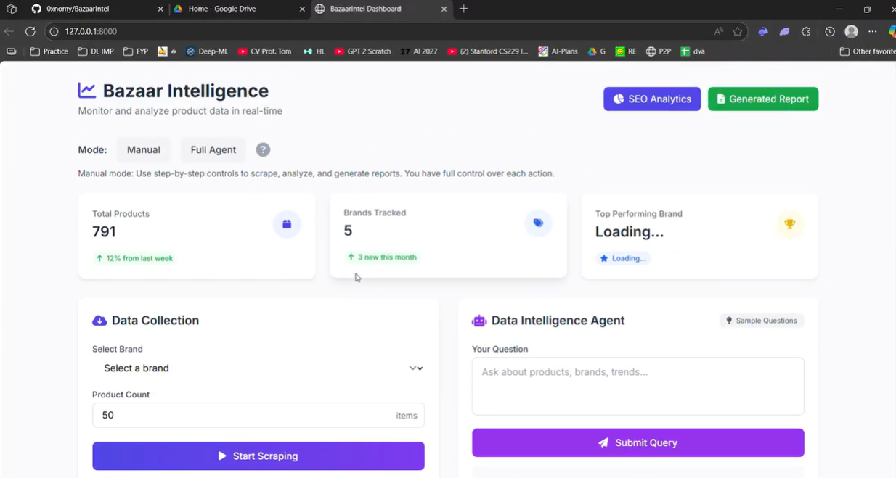

# BazaarIntel

BazaarIntel is a data engineering–driven AI analytics platform designed to deliver scalable e-commerce insights for Pakistani fashion brands. It builds robust end-to-end data pipelines that automate dynamic web scraping, data integration, semantic SEO analysis, and interactive report generation, leveraging large language models (LLMs) and agentic workflows.[web:42]

## Key Features and Data Engineering Workflow

- **End-to-End Data Pipeline**: Automates user goal interpretation, dynamic data extraction, semantic analytics, data storage, and automated reporting using a modular pipeline architecture.
- **Dynamic Web Scraping at Scale**: Efficiently scrapes evolving product data from multiple e-commerce platforms using Playwright, with handling of heterogeneous and case-insensitive URLs.
- **Integrated Data Storage**: Stores structured product metadata in a relational SQLite database supporting complex querying and analytics.
- **Semantic SEO Analysis**: Employs LLM-based keyword extraction and scoring to quantify SEO impact, keyword density, content quality, and uniqueness, with results cached for performant reuse.
- **Interactive Real-Time Dashboard**: Presents product-level analytics, brand comparisons, and trend visualizations driven by up-to-date data warehouses.
- **Automated Report Generation**: Utilizes LLM-powered generation and querying capabilities to produce comprehensive, data-driven business intelligence reports.

## Architecture and Pipeline Stages

1. **Agentic Orchestration Layer (LangGraph + LLaMA 4)**  
   - Orchestrates workflow from user input to scraping commands, SEO analysis, and data persistence with feedback loops for pipeline automation.

2. **Data Collection and Integration**  
   - Uses Playwright for browser-based scraping, handling multiple base URLs with robust matching rules.  
   - Extracted data is parsed and structured with BeautifulSoup before ingestion in SQLite.

3. **Semantic Analytics Layer**  
   - Performs LLM inference to extract high-value SEO features using Groq API powered LLaMA 4.  
   - Calculates quantitative SEO metrics, facilitating downstream analytics.

4. **API and Query Interfaces**  
   - Provides RESTful endpoints to trigger scraping, generate SEO keywords, fetch analytics, generate reports, and support agentic SQL+LLM queries.

## Technologies

- **Groq API** for LLaMA 4 LLM inference enabling semantic analysis and report generation.  
- **Playwright** for dynamic, scalable browser automation and scraping of rich e-commerce sites.  
- **BeautifulSoup** for efficient HTML parsing and data extraction.  
- **SQLite** for lightweight, relational data storage supporting project-specific schema.
- **FastAPI** for high-performance API serving and real-time dashboard endpoints.

